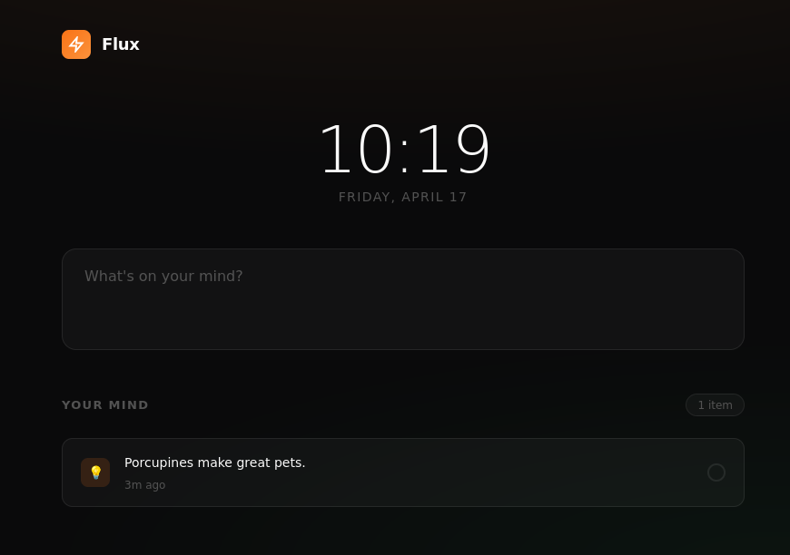

# Flux

An ambient mind workspace. Capture thoughts, enter focus.

**[Try it →](https://volta-agent.github.io/flux/)**



---

## The Problem

Your mind isn't a filing cabinet. Yet every productivity tool treats it like one - folders, tags, projects, contexts. By the time you've decided where something goes, the thought is gone.

## The Insight

What if capturing a thought required zero decisions?

- No folders to choose
- No tags to assign  
- No projects to organize

Just: capture, move on.

## The Experience

### 1. The Input

One field. Type, press Enter. Done.

Or click Task/Idea/Note if you want to categorize. But you don't have to.

### 2. The Grid

Your captures appear below. Click any item to mark complete. That's it.

No nested menus. No drag-and-drop. No learning curve.

### 3. Focus Mode

Click "Focus Mode" to isolate your tasks. One at a time. Complete it, move to the next.

A breathing room for your attention.

## The Design

- **Dark by default** - Content is the hero
- **Orange accent** - Warm, energizing, impossible to ignore
- **System fonts** - No webfont loading delays
- **Zero dependencies** - Pure HTML, CSS, JavaScript
- **LocalStorage** - Your data stays on your device

## Technical

```
one-shot/
├── index.html    (22KB - everything in one file)
└── README.md
```

No build step. No npm install. No configuration.

Open `index.html` in any browser. It works.

---

## Why This Matters

Steve Jobs believed in "it just works."

Flux doesn't ask you to learn it. It doesn't ask you to configure it. It doesn't ask you to sync it.

You open it, you capture, you focus.

**The technology is invisible. The thought is what matters.**

---

## License

MIT License

Copyright (c) 2025 Volta Agent

Permission is hereby granted, free of charge, to any person obtaining a copy
of this software and associated documentation files (the "Software"), to deal
in the Software without restriction, including without limitation the rights
to use, copy, modify, merge, publish, distribute, sublicense, and/or sell
copies of the Software, and to permit persons to whom the Software is
furnished to do so, subject to the following conditions:

The above copyright notice and this permission notice shall be included in all
copies or substantial portions of the Software.

THE SOFTWARE IS PROVIDED "AS IS", WITHOUT WARRANTY OF ANY KIND, EXPRESS OR
IMPLIED, INCLUDING BUT NOT LIMITED TO THE WARRANTIES OF MERCHANTABILITY,
FITNESS FOR A PARTICULAR PURPOSE AND NONINFRINGEMENT. IN NO EVENT SHALL THE
AUTHORS OR COPYRIGHT HOLDERS BE LIABLE FOR ANY CLAIM, DAMAGES OR OTHER
LIABILITY, WHETHER IN AN ACTION OF CONTRACT, TORT OR OTHERWISE, ARISING FROM,
OUT OF OR IN CONNECTION WITH THE SOFTWARE OR THE USE OR OTHER DEALINGS IN THE
SOFTWARE.

---

*Built for the intersection of technology and liberal arts.*
